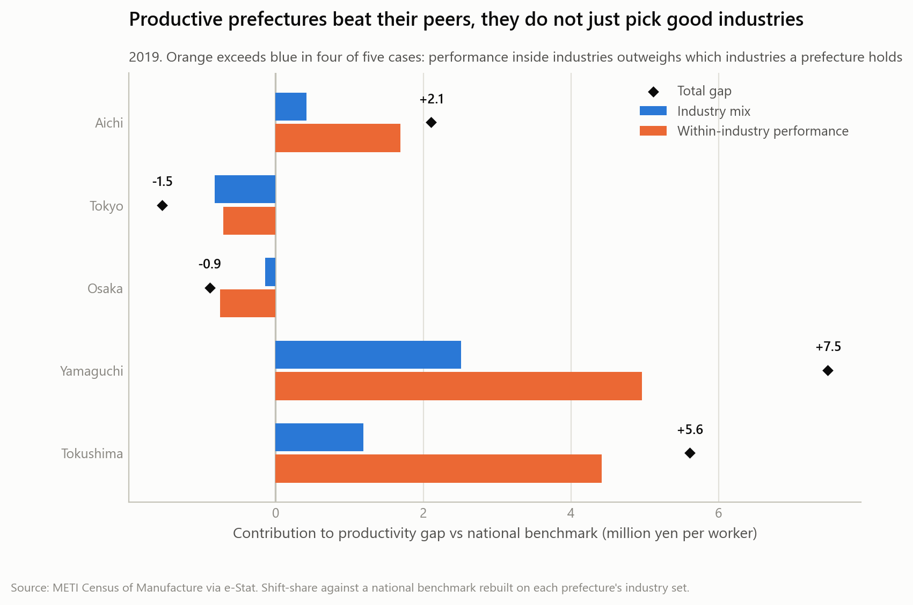

# Japanese Manufacturing: Benchmarking the 47 Prefectures

[](https://github.com/SarthakDT/japan-manufacturing-analysis/actions/workflows/checks.yml)
[](LICENSE)
[](https://www.python.org/)
[](https://www.e-stat.go.jp/en)

**Where does a prefecture's manufacturing gap come from: the industries it hosts, or
how well those industries perform?**

Manufacturing value added per worker across all 47 prefectures and 24 industry
divisions, 2016–2020, built from Japan's Census of Manufacture via the e-Stat API.

---

## Who this is for

**An illustrative use case, not commissioned work:** a prefectural government
planner benchmarking the prefecture's manufacturing sector against the rest of Japan.

The planner's decision is where to look first. A prefecture below the national
figure can be there for two different reasons, and they call for different
responses:

- **It hosts industries that generate little value added per worker anywhere.**
  The issue is the industry base.
- **Its industries trail the same industries elsewhere.** The issue is what happens
  inside them.

This project separates the two for every prefecture and year, and presents the
result as a dashboard. A one-page version for the planner is in
[docs/executive-summary.md](docs/executive-summary.md).

## Key insights

All figures are value added per worker in million yen, nominal, reference year 2019
unless stated.

1. **The biggest manufacturing region is not the most productive per worker.** Aichi
   produces **12.8%** of national manufacturing value added but ranks **7th of 47**
   on value added per worker. The top three are Yamaguchi (20.3), Tokushima (18.4)
   and Shiga (17.8), all mid-sized. Yamaguchi's lead rests on chemicals, where it
   holds 3.2 times the national share of employment.
2. **Industries differ far more than regions.** Value added per worker ranges
   **5.90×** across industries, from petroleum & coal (34.8) to leather (5.9). So the
   mix of industries a prefecture hosts moves its headline figure a long way.
3. **Yet for most prefectures, performance inside industries matters more than which
   industries they host.** The within-industry term is larger than the mix term in
   **36–37 of 47** prefectures in every year, 2016–2019. Among the 30 prefectures
   below the national figure in 2019, it is the larger term for 24.
4. **Most prefectures trail on both counts.** In 2019, **26 of 47** have a weaker
   industry mix *and* weaker within-industry performance than the national
   benchmark. They include Osaka, Saitama and Tokyo. **13** are strong on both.
5. **Capital intensity explains the industry ranking, not the regional one.** Across
   the 24 industries, capital per worker and value added per worker rank together:
   Spearman **+0.72** pooled over 2016–2019, and +0.63 to +0.73 in single years. At
   prefecture level, capital deepening explained nothing.
6. **Nominal value added per worker was flat:** +0.34% a year over 2016–2019, and
   unchanged in 2020 (12.97).

**Implication for a planner.** For most prefectures below the national figure,
recruiting higher-value industries addresses the smaller part of the gap. The first
question is what differs *within* the industries the prefecture already hosts. That
could be which products they make, plant scale or the age of the equipment. The
[caveat below](#the-diagnostic) matters for reading that correctly.

## The diagnostic

A shift-share decomposition splits each prefecture's gap to the national benchmark
exactly into an **industry mix** effect and a **within-industry** effect. The signs
of the two place every prefecture in one of four quadrants:

| Diagnosis, 2019 | Prefectures | Largest by employment | Where a planner looks first |
|---|---|---|---|
| Strong mix, strong performance | 13 | Aichi, Shizuoka, Hyogo | Protect what works |
| Weak mix, strong performance | 5 | Shiga, Kyoto, Ehime | The industry base, not the firms |
| Strong mix, weak performance | 3 | Fukushima, Okayama, Toyama | Performance inside the industries held |
| Weak mix, weak performance | 26 | Osaka, Saitama, Tokyo | Both |

> **Diagnostic, not prescriptive.** The within-industry term is not purely firm
> efficiency. A 2-digit industry bundles very different products. "Chemicals"
> covers both petrochemicals and cosmetics, so a within-industry advantage may
> reflect *which* chemicals a prefecture makes. It also absorbs plant scale and the
> age of the capital stock. The quadrants say where to look, not what to do, and
> nothing here is causal. → [docs/concepts.md](docs/concepts.md) §8.7



## Dashboard

Two front-ends read one extract, [`dashboard/data/`](dashboard/data/), a star schema
built by [`src/build_dashboard_data.py`](src/build_dashboard_data.py). Every
analytical number is computed once, there. The dashboards only filter and
aggregate. Both have the same five pages:

| Page | What it answers |
|---|---|
| Overview | Where each prefecture stands, against the national figure |
| Prefecture benchmark | Why one prefecture differs: a waterfall from the national benchmark through mix and within-industry effects to its published figure, plus which of its industries beat or miss expectation |
| Diagnosis | All 47 on the mix × within quadrant chart |
| Industry context | Why industry mix matters: value added and capital per worker by industry |
| Notes | Definitions, limitations, attribution |

- **Streamlit app**, in [`app/`](app/). Run it locally with
  `streamlit run app/streamlit_app.py`. Every page is tested headlessly in CI.
- **Power BI**: build it from [`dashboard/POWER_BI_GUIDE.md`](dashboard/POWER_BI_GUIDE.md),
  which gives the data model, the DAX measures and the page layouts.

Both are checked against one list of figures,
[`dashboard/expected_values.md`](dashboard/expected_values.md): automatically for
Streamlit, by checklist for Power BI.

## How it's built

```
e-Stat API → validation → processed CSVs → DuckDB + SQL views → dashboard extract → Power BI / Streamlit
```

- **Acquisition.** [`src/fetch_estat.py`](src/fetch_estat.py) calls the e-Stat API
  and writes a provenance manifest for every download.
- **Validation.** [`src/validate_manufacturing.py`](src/validate_manufacturing.py)
  checks the 47 × 24 grid, flags suppressed cells and reconciles against published
  national totals.
- **Analysis.** Shift-share with its identity asserted to 1e-9
  ([`src/shift_share.py`](src/shift_share.py)); one location quotient and Herfindahl
  implementation ([`src/metrics.py`](src/metrics.py)); robust residuals
  ([`src/anomaly_detect.py`](src/anomaly_detect.py)).
- **SQL layer.** Postgres-dialect SQL over DuckDB for the cross-table questions that
  were awkward across 14 CSVs, and the source of the dashboard's
  capital-intensity figures ([`sql/`](sql/)).
- **Verification.** [`src/run_checks.py`](src/run_checks.py) runs every self-test, the
  warehouse load checks, the extract's checks and the app tests. GitHub Actions runs it
  on a clean clone for every push. The data can't refresh (see
  [Data sources](#data-sources)), so what recurs is verification.

### Data quality: three things the source gets wrong or hides

**Year labels are misleading.** e-Stat labels datasets by *survey* year, but from the
2017 survey the financial items refer to the *previous* year, so `2019年確報` holds
2018 value added. This was verified numerically: the 2019 survey's national row
equals the 2020 survey's row labelled 2018, to the yen. e-Stat's own `SURVEY_DATE`
field is wrong for every survey since 2017. → [docs/reference-years.md](docs/reference-years.md)

**Suppressed cells are not zeros.** Confidentiality suppression is
missing-not-at-random and targets thin prefecture × industry cells. Suppressed
values are held as missing with explicit flags, never filled.
→ [docs/concepts.md](docs/concepts.md) §3.14

**Prefecture totals come from the published total row**, not from summing
industries, because summing drops suppressed cells and the loss concentrates in
small prefectures (Kochi 1.54%, Aichi 0.00%). The dashboard's waterfall carries a
*suppression adjustment* step for exactly this reason, so it closes to the published
figure.

Validation reconciles prefecture sums against published national totals at
**0.0000%** on counts, with monetary gaps tracking the suppressed-cell count exactly.

## Quick start

```bash
git clone https://github.com/SarthakDT/japan-manufacturing-analysis.git
cd japan-manufacturing-analysis
pip install -r requirements.txt
```

### Runs from a clone, no API key

The validated CSVs, the analysis panel and the dashboard extract are committed.

```bash
python src/run_checks.py                         # everything below, checked (~1 min)
streamlit run app/streamlit_app.py               # the dashboard
python src/build_dashboard_data.py               # rebuild the dashboard extract
python src/build_warehouse.py --rebuild --check  # DuckDB store + load checks
python src/build_warehouse.py --questions        # the two SQL analyses
python src/cluster_typology.py                   # clustering + permuted null
python src/anomaly_detect.py                     # median-polish residuals
```

The four notebooks in `notebooks/` also run from a clone.

### Requires re-acquiring the raw data

`validate_manufacturing.py`, `build_panel.py` and `econ_census.py` read the raw API
pages, which are gitignored (about 19 MB, fully regenerable). To rebuild from source
you need a free [e-Stat API key](https://www.e-stat.go.jp/mypage/user/preregister):

```bash
export ESTAT_APP_ID=<your key>
python src/fetch_estat.py discover
python src/fetch_estat.py meta --statsdataid 0003432907
python src/fetch_estat.py data --statsdataid 0003432907 --reference-year 2018 --table 3-01
python src/validate_manufacturing.py --reference-year 2018 --table 3-01
python src/build_panel.py
```

Always run `meta` before `data` on an unfamiliar table. Which dimension holds
measures, industry and geography varies from table to table. The measure
dimension's name contains 産業 ("industry"), so a naive name match picks the wrong
dimension.

## Advanced analysis (appendix)

These support the insights above. They are secondary to the diagnostic.

| Analysis | Result | Where |
|---|---|---|
| Within-industry spread | Holding industry fixed, the median spread across prefectures is **6.62×**, wider than the spread between industries | [notebook 02](notebooks/02_industry_mix_analysis.ipynb) |
| Variance decomposition | Industry identity explains **51.6%** of cell-level variance in log value added per worker, prefecture identity **15.0%**. Both this and insight 3 hold: prefectures are too diversified for industry differences to dominate their totals | [notebook 02](notebooks/02_industry_mix_analysis.ipynb) |
| Prefecture typology | Clustering gives one 7-versus-40 split that beats a permuted null and is stable year to year. But k-means and Ward disagree on membership (ARI 0.351), so prefectures **do not form distinct industrial types**. Reported as provisional | [Appendix A](notebooks/03_prefecture_typology.ipynb) |
| Anomaly detection | Median polish of log value added per worker. Once industry and region are removed, most cells are unremarkable (median absolute residual 0.17 log points). The extremes are dominated by volatile process industries. These residuals are the dashboard's "beats or misses expectation" | [Appendix B](notebooks/04_anomaly_detection.ipynb) |

### Why the project reports magnitudes, not significance tests

An earlier phase tested three hypotheses, about specialization, aging and diversity.
The original 15 tests at n = 47 produced nominally significant results that did not
survive correction for multiple comparisons (Bonferroni or Benjamini-Hochberg), so
the project does not treat those associations as robust evidence. That analysis was
withdrawn rather than published with caveats. → [docs/concepts.md](docs/concepts.md)
§3.5a · [docs/measurement-framework.md](docs/measurement-framework.md) §4

## Data sources

**[METI Census of Manufacture](https://www.meti.go.jp/statistics/tyo/kougyo/)**
(工業統計調査), via the e-Stat API: establishments, persons engaged, shipments,
value added and capital stock by prefecture × industry.

**Statistics Bureau intercensal adjusted population** (国勢調査結果による補間補正人口).

**2021 Economic Census** (令和3年経済センサス‐活動調査) supplies reference year 2020,
with prefecture totals but no industry detail.

The panel **ends at reference year 2020 permanently**. The successor Economic
Structure Survey publishes manufacturing with no area dimension, so value added by
prefecture does not exist for 2021 onward. This is a limit of the data, not a
choice of scope.

## Limitations

- **Value added is nominal**, never deflated, so the growth figure is nominal growth.
- **Per worker, not per hour.** Hours are not published at this granularity.
- **Capital data covers only establishments with 30+ employees**, while the main
  panel covers 4+.
- **Everything is correlational.** No causal identification is claimed, and the
  diagnostic is not a recommendation.
- The primary value-added column **blends net and gross** value added, depending on
  establishment size.
- 2-digit industries are coarse. See the caveat under [The diagnostic](#the-diagnostic).

## Documentation

Full index at **[docs/README.md](docs/README.md)**. The most useful entry points:

- [docs/executive-summary.md](docs/executive-summary.md): the one-page version for the planner
- [docs/concepts.md](docs/concepts.md): every concept used, from first principles, with reading lists. §8 covers the dashboards: star schema in Power BI, DAX filter context, ratio of sums, CI
- [dashboard/POWER_BI_GUIDE.md](dashboard/POWER_BI_GUIDE.md): the Power BI build
- [docs/reference-years.md](docs/reference-years.md): the year-label problem and its proof
- [docs/work-log.md](docs/work-log.md): the chronological development record, including the mistakes

## Licence

Code and documentation are [MIT licensed](LICENSE).

This project uses the e-Stat API (政府統計の総合窓口). Its content is not guaranteed by
the Japanese government.

> この分析は、政府統計総合窓口(e-Stat)のAPI機能を使用していますが、
> サービスの内容は国によって保証されたものではありません。
