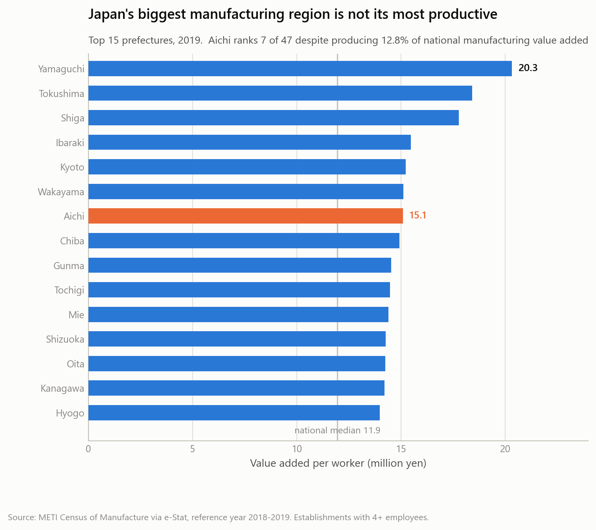

# Japanese Manufacturing Productivity

[](LICENSE)
[](https://www.python.org/)
[](https://www.e-stat.go.jp/en)

**Why are some Japanese prefectures more manufacturing-productive than others?**

A prefecture-level analysis of manufacturing value added per worker across all 47
prefectures and 24 industry divisions, 2016–2020, built from Japan's Census of
Manufacture via the e-Stat API.

---

## Headline result

Japan's largest manufacturing region is not its most productive. Aichi produces
**12.8%** of national manufacturing value added and ranks **7th of 47** on value added
per worker. Tokyo ranks 27th, Osaka 22nd.



The leaders are mid-sized prefectures running capital-intensive process industries.
That turns out to be the key to the whole analysis: **what a region makes matters as
much as how well it makes it**, and separating the two is the central methodological
problem.

## Findings

These are **magnitudes and decompositions, not significance tests**. With 47
prefectures there is not enough statistical power for hypothesis testing to separate
signal from noise, so the project reports quantities that do not depend on a p-value.
See [Statistical power](#statistical-power) below.

| # | Finding |
|---|---|
| 1 | Aichi produces 12.8% of national value added but ranks 7th of 47 on productivity |
| 2 | Productivity differs **5.90×** between industries, from petroleum and coal (34.8 million yen per worker) to leather (5.9) |
| 3 | Large regional differences **survive holding industry fixed** — median within-industry spread of **6.62×**, wider than the between-industry spread |
| 4 | Productive prefectures **beat their peers** rather than just holding better industries: within-industry performance outweighs industry mix in 37 of 47 prefectures, stable across all four years |
| 5 | Industry identity explains **51.6%** of cell-level variance against **15.0%** for prefecture identity, while the aggregate decomposition points the other way — both hold, because prefectures are too diversified for industry differences to reach their totals |
| 6 | Nominal productivity was **flat**: +0.34% a year, 2016–2019, and unchanged in 2020 |
| 7 | **Capital intensity explains productivity between industries but not between regions.** Across the 24 industries the two rank together at Spearman **+0.72** (p < 0.001); at prefecture level capital deepening explained nothing |
| 8 | **Prefectures do not form distinct industrial types.** Clustering gives one 7-versus-40 split that beats a permuted null and is stable year to year, but k-means and Ward disagree on membership (ARI 0.351), so it is reported as provisional |
| 9 | **Most cells are unremarkable once industry and region are removed.** Median absolute residual 0.17 log points; the extremes are dominated by volatile process industries |

## Repository structure

```
├── src/                        Pipeline modules, each runnable and self-tested
│   ├── fetch_estat.py            e-Stat API client, writes provenance manifests
│   ├── validate_manufacturing.py cleaning, suppression flags, 47×24 grid validation
│   ├── dataset.py                the one canonical CSV loader
│   ├── metrics.py                the one location quotient and Herfindahl index
│   ├── build_panel.py            prefecture × year analysis panel
│   ├── shift_share.py            mix/within decomposition with asserted identity
│   ├── econ_census.py            reference year 2020 + comparability gate
│   ├── lq_break_test.py          rank-correlation comparability check across 2016
│   ├── build_warehouse.py        loads the CSVs into a queryable DuckDB store
│   ├── cluster_typology.py       CLR → PCA → clustering, with a permuted null
│   ├── anomaly_detect.py         median polish, robust two-way residuals
│   └── viz_style.py              validated palette, romaji and industry label maps
├── sql/                        Postgres-dialect SQL over DuckDB
│   ├── 01_build.sql              fact_cells, fact_panel, two lookups
│   ├── 02_views.sql              capital intensity, size-class comparison, YoY
│   └── 03_questions.sql          two questions the 14 CSVs made awkward
├── notebooks/                  Executed, outputs embedded — render directly on GitHub
│   ├── 01_exploratory_analysis.ipynb
│   ├── 02_industry_mix_analysis.ipynb
│   ├── 03_prefecture_typology.ipynb
│   └── 04_anomaly_detection.ipynb
├── processed_data/             Validated CSVs — notebooks run without an API key
├── raw_data/                   Download manifests (bulk JSON is gitignored)
├── metadata/                   Validation reports and table indexes
├── outputs/charts/             Generated figures
└── docs/                       See docs/README.md for the index
```

## Quick start

```bash
git clone https://github.com/SarthakDT/japan-manufacturing-analysis.git
cd japan-manufacturing-analysis
pip install -r requirements.txt
```

The processed panel is committed, so the analysis runs with no API key:

```bash
python src/build_panel.py                        # panel, 235 rows, 13 checks
python src/build_warehouse.py --rebuild --check  # DuckDB store + load checks
python src/build_warehouse.py --questions        # the two SQL analyses
python src/cluster_typology.py                   # clustering + permuted null
python src/anomaly_detect.py                     # median-polish residuals
```

To re-acquire the raw data you need a free [e-Stat API key](https://www.e-stat.go.jp/mypage/user/preregister):

```bash
export ESTAT_APP_ID=<your key>
python src/fetch_estat.py discover
python src/fetch_estat.py meta --statsdataid 0003432907
python src/fetch_estat.py data --statsdataid 0003432907 --reference-year 2018 --table 3-01
```

Always run `meta` before `data` on an unfamiliar table. Which dimension holds
measures, industry and geography varies per table, and the measure dimension's name
contains 産業, which trivially fools a naive match.

## Data sources

**[METI Census of Manufacture](https://www.meti.go.jp/statistics/tyo/kougyo/)**
(工業統計調査) via the e-Stat API — establishments, persons engaged, shipments, value
added and capital stock by prefecture × industry.

**Statistics Bureau intercensal adjusted population** (国勢調査結果による補間補正人口) —
population by three age bands, chosen over forward-projected estimates because
2016–2020 is reconciled against both the 2015 and 2020 censuses.

**2021 Economic Census** (令和3年経済センサス‐活動調査) supplies reference year 2020.

The panel **ends at reference year 2020 permanently**. The successor Economic
Structure Survey publishes manufacturing with no area dimension, so value added by
prefecture does not exist for 2021 onward. That is a data limit, not a scope choice.

## Data quality

Three source characteristics shaped the pipeline, and each is documented with its
verification.

**Year labels in the source are misleading.** e-Stat labels datasets by *survey* year,
but from the 2017 survey the financial items refer to the *previous* calendar year, so
`2019年確報` contains 2018 value added. Verified numerically: the 2019 survey's national
row equals the 2020 survey's row labelled 2018, to the yen. e-Stat's own `SURVEY_DATE`
field is wrong for every survey since 2017. → [docs/reference-years.md](docs/reference-years.md)

**Suppressed cells are not zeros.** Confidentiality suppression is
missing-not-at-random, targeting thin prefecture × industry cells. They are held as
`NaN` with explicit flags. → [docs/concepts.md](docs/concepts.md) §3.14

**Prefecture totals come from the published total row**, not from summing industries,
because summing drops suppressed cells and the loss concentrates in small prefectures
(Kochi 1.54%, Aichi 0.00%).

Validation reconciles prefecture sums against published national totals at **0.0000%**
on counts, with monetary gaps tracking the suppressed-cell count exactly.

## Statistical power

An earlier phase of this project tested three hypotheses about specialization, aging
and diversity across **15 correlation and regression tests** at n = 47. Seven reached
nominal significance at 0.05; **none survived correction for multiple comparisons**
under either Bonferroni or Benjamini-Hochberg.

Those findings were **withdrawn and their analysis deleted** rather than published with
caveats. The project now reports magnitudes. New hypotheses are being designed around
the prefecture × industry panel, which raises the sample from 47 to 1,128 observations
per year.

→ [docs/concepts.md](docs/concepts.md) §3.5a · [docs/measurement-framework.md](docs/measurement-framework.md) §4

## Limitations

- **Value added is nominal**, never deflated, so the growth figure is nominal growth.
- **Productivity is per worker, not per hour**; hours are unpublished at this granularity.
- **Capital data covers only 30+ employee establishments**, while the main panel is 4+.
- **Everything is correlational.** No causal identification is claimed anywhere.
- The primary value-added column **blends net and gross** by establishment size.

## Documentation

Full index at **[docs/README.md](docs/README.md)**. Most useful entry points:

- [docs/concepts.md](docs/concepts.md) — every concept used, from first principles, ~50 entries
- [docs/reference-years.md](docs/reference-years.md) — the year-label problem and its proof
- [docs/concepts.md](docs/concepts.md) §7 — data engineering and mining, including **why this project deliberately did not build a star schema**
- [docs/work-log.md](docs/work-log.md) — chronological development record, including the mistakes

## Licence

Code and documentation are [MIT licensed](LICENSE).

This project uses the e-Stat API (政府統計の総合窓口). Its content is not guaranteed by
the Japanese government.

> この分析は、政府統計総合窓口(e-Stat)のAPI機能を使用していますが、
> サービスの内容は国によって保証されたものではありません。
