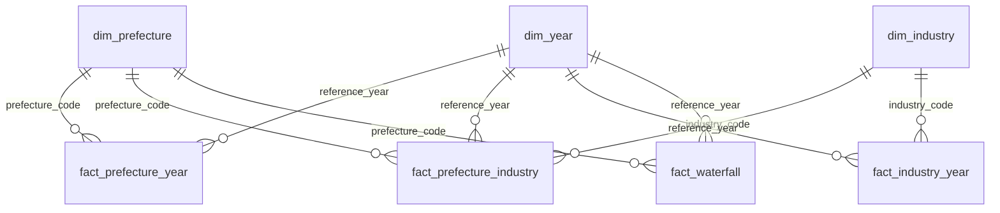

# Power BI build guide

How to build the Power BI version of the prefecture benchmark dashboard from
`dashboard/data/`. Written for someone who knows SQL but has not used Power BI.

The same extract feeds the Streamlit app in `app/`. Every analytical number (the
shift-share, location quotients, residuals, ranks and the diagnosis) is already
computed in the CSVs. Power BI's job is to filter and aggregate, never to
re-derive. When you finish, check the report against
[expected_values.md](expected_values.md). If a number disagrees, the DAX is wrong,
not the data.

**You need:** Power BI Desktop (free, Windows), about 3 to 4 hours for a first build.

Concepts behind each step are in [docs/concepts.md](../docs/concepts.md) §8.

---

## Contents

1. [Import and data types](#1-import-and-data-types)
2. [The model: relationships](#2-the-model-relationships)
3. [DAX measures](#3-dax-measures)
4. [Pages](#4-pages)
5. [Formatting](#5-formatting)
6. [Publishing](#6-publishing)
7. [Checklist](#7-checklist)

---

## 1. Import and data types

**Home → Get data → Text/CSV**, once for each of the seven files in `dashboard/data/`.
On each preview, click **Transform Data**, not Load. That opens Power Query.

**The one step that matters most: set every code column to Text.** Power Query
guesses types from the first rows, reads `09` as the whole number 9, and your
relationships then silently fail to match. For each table:

| Column | Type |
|---|---|
| `prefecture_code`, `industry_code`, `top_industry_code` | **Text** |
| `reference_year`, `step_order`, `rank_va_per_worker`, `region_order` | Whole number |
| `has_industry_detail` | True/False |
| everything numeric else | Decimal number |
| names, `region`, `diagnosis`, `step`, flags, `instrument` | Text |

To change a type, click the icon at the left of the column header. If Power Query
added a "Changed Type" step that already converted a code to a number, **delete
that step** in the Applied Steps pane first, then set Text. Changing it back
afterwards won't restore the lost leading zero.

The files are UTF-8 with a byte-order mark, so Japanese names import correctly.
If you see `愛知` instead of `愛知`, set **File origin** to `65001: Unicode (UTF-8)`.

**Close & Apply.**

**Blank is not zero.** Empty cells in the CSVs mean *not published* (a
confidentiality-suppressed cell) or *does not exist* (no industry detail for 2020).
Leave them blank. Never replace them with 0: a suppressed cell is a real number the
publisher withheld, and a zero mix effect would read as "exactly at benchmark".

---

## 2. The model: relationships

Open **Model view** (the third icon on the left). Power BI may have auto-detected
some relationships. Delete any it made, then create these by dragging the key
from the dimension onto the fact:



For each of the nine relationships, double-click the line and confirm:

- **Cardinality:** One to many (1:\*), dimension on the "one" side
- **Cross filter direction:** **Single**
- **Make this relationship active:** ticked

Single direction means filters flow from dimensions into facts, never back. That is
what you want: a region slicer filters the facts; a fact never filters the list of
regions.

Leave `fact_prefecture_year[top_industry_code]` **unrelated**. A second relationship
to `dim_industry` would create an ambiguous filter path.

**Always slice by dimension columns, never by fact columns.** A slicer on
`dim_prefecture[region]` filters all four facts. A slicer on a fact's own
`prefecture_code` filters only that fact. That is the reason the model is a star.

**Hide the key columns in the facts** (right-click → Hide in report view), plus
every column that is a ratio: `va_per_worker`, `national_va_per_worker`, `lq`,
`employment_share`, `national_employment_share`, `capital_per_worker_30plus`,
`va_per_worker_30plus`. Hiding them means nobody can drag a ratio into a visual
and get it summed or averaged. The measures below replace them.

**Sort by column**, so labels appear in a meaningful order:

- `dim_prefecture[region]` sorted by `region_order`
- `fact_waterfall[step]` sorted by `step_order`

(Select the column in Data view → Column tools → Sort by column.)

---

## 3. DAX measures

Create a dedicated table to hold them: **Home → Enter data**, name it `_Measures`,
load it, then create each measure with **New measure** while that table is selected.
Each measure comes with the reason it is written the way it is.

### Headline

```dax
Total VA = SUM ( fact_prefecture_year[value_added] )

Total Employment = SUM ( fact_prefecture_year[employment] )

VA per Worker = DIVIDE ( [Total VA], [Total Employment] )
```

**Ratio of sums, never an average of the ratio column.** For 2019 this gives
**12.99** nationally. Averaging the `va_per_worker` column gives 12.24, weighting
Tottori (33,000 workers) the same as Aichi (850,000). This is the most common
Power BI mistake, and the reason the ratio columns are hidden. `DIVIDE` returns
blank instead of an error when the denominator is zero.

```dax
National VA per Worker =
CALCULATE ( [VA per Worker], REMOVEFILTERS ( dim_prefecture ) )
```

`REMOVEFILTERS` drops the prefecture and region filters and keeps the year, so every
bar can be compared with the national figure for the same year.

```dax
Gap to National = [VA per Worker] - [National VA per Worker]

Share of National VA =
DIVIDE ( [Total VA], CALCULATE ( [Total VA], REMOVEFILTERS ( dim_prefecture ) ) )
```

```dax
Rank =
IF (
    HASONEVALUE ( dim_prefecture[prefecture_code] ),
    RANKX ( ALL ( dim_prefecture ), [VA per Worker], , DESC, SKIP )
)
```

`ALL ( dim_prefecture )` ranks against all 47 prefectures even when a region
slicer is on. Without it, Aichi would rank 1st of the Chubu prefectures, not 7th of
47. It must match the stored `rank_va_per_worker`.

### Decomposition: non-additive, so guarded

The shift-share terms are defined **per prefecture**, against a benchmark built on
that prefecture's own industries. Adding Aichi's mix effect to Mie's does not
produce the mix effect of Aichi and Mie together. So these measures return blank
unless exactly one prefecture is in context:

```dax
Benchmark =
IF ( HASONEVALUE ( dim_prefecture[prefecture_code] ),
     SUM ( fact_prefecture_year[shift_share_benchmark] ) )

Mix Effect =
IF ( HASONEVALUE ( dim_prefecture[prefecture_code] ),
     SUM ( fact_prefecture_year[mix_effect] ) )

Within Effect =
IF ( HASONEVALUE ( dim_prefecture[prefecture_code] ),
     SUM ( fact_prefecture_year[within_effect] ) )

Suppression Adjustment =
IF ( HASONEVALUE ( dim_prefecture[prefecture_code] ),
     SUM ( fact_prefecture_year[suppression_adjustment] ) )

Diagnosis = SELECTEDVALUE ( fact_prefecture_year[diagnosis], "Select one prefecture" )
```

`SUM` here only unwraps a single stored value, because the guard ensures at most one
row per year is in context. **Always pair these with a single-select year slicer.**
For 2020 they return blank: there is no industry detail to decompose.

```dax
Waterfall Amount = SUM ( fact_waterfall[amount] )
```

### Industry mix of one prefecture

```dax
Industry Employment = SUM ( fact_prefecture_industry[employment] )

Share of Prefecture Employment =
DIVIDE (
    [Industry Employment],
    CALCULATE ( [Industry Employment], REMOVEFILTERS ( dim_industry ) )
)

National Share of Employment =
CALCULATE ( [Share of Prefecture Employment], REMOVEFILTERS ( dim_prefecture ) )
```

The denominator removes the industry filter, so each industry is divided by the
prefecture's total across all industries. The second measure also removes the
prefecture filter, which gives the national mix. With Aichi, 2019 and
*Transport equipment* in context, the first returns **37.4%** and the second
**13.8%**. They must agree with the stored `employment_share` and
`national_employment_share` columns, which is a good first test of your
understanding of filter context.

```dax
vs Expected =
IF ( HASONEVALUE ( dim_industry[industry_code] ),
     SUM ( fact_prefecture_industry[pct_vs_expected] ) )
```

The median-polish residual, as a percentage: how far a prefecture × industry cell
beats or trails what its region and its industry together would predict.

### Industry context

```dax
Industry VA per Worker =
DIVIDE ( SUM ( fact_industry_year[value_added] ), SUM ( fact_industry_year[employment] ) )

Capital per Worker (30+) =
DIVIDE ( SUM ( fact_industry_year[capital_stock_30plus] ),
         SUM ( fact_industry_year[employment_30plus] ) )

VA per Worker (30+) =
DIVIDE ( SUM ( fact_industry_year[value_added_30plus] ),
         SUM ( fact_industry_year[employment_30plus] ) )
```

Capital data covers only establishments with 30+ employees, so both axes of the
capital chart use the 30+ figures. Mixing a 30+ numerator with the 4+ employment
would compare different populations.

**Formatting:** select each ratio measure and set **Measure tools → Format** to
Decimal number with 2 decimal places. Set the share measures to Percentage.

---

## 4. Pages

Add a **Year** slicer to every page from `dim_year[reference_year]`: Slicer
settings → **Single select**, set to 2019. On a page with no decomposition, a
multi-year view is fine, but a single year keeps the numbers comparable with
`expected_values.md`.

To keep the same year across pages: **View → Sync slicers**, tick all pages.

### Page 1 · Overview

*The question: where does each prefecture stand?*

| Visual | Fields |
|---|---|
| 4 × **Card** | `VA per Worker`, `Total Employment`, `Total VA`, `Share of National VA` |
| **Clustered bar chart** | Y-axis `dim_prefecture[name_en]`, X-axis `VA per Worker`, sorted descending by `VA per Worker` |
| **Slicer** | `dim_prefecture[region]` |

On the bar chart, open **Analytics pane → Constant line** (or X-axis constant line)
and set its value to the `National VA per Worker` measure (fx button), labelled
"national". Set the chart height to show all 47 bars.

Optional **map**. Use the Azure Maps visual, with Location
`dim_prefecture[map_location]` (for example "Aichi Prefecture, Japan") and bubble
size `Total VA`. Map visuals may be disabled by default under File → Options →
Security. **Check every bubble lands in the right prefecture before keeping it.**
Geocoding occasionally resolves a name to a city elsewhere. The map is secondary:
filled-area maps make Hokkaido look important because it is large.

### Page 2 · Prefecture benchmark (the core page)

*The question: why is this prefecture above or below the national figure?*

| Visual | Fields |
|---|---|
| **Slicer** (dropdown, single select) | `dim_prefecture[name_en]` |
| **Card** | `VA per Worker`, with `National VA per Worker` as a second card beside it |
| **Card** | `Rank` (format as "7 of 47" by adding a text card, or just the number) |
| **Card** | `Diagnosis` |
| **Waterfall chart** | Category `fact_waterfall[step]`, Y-axis `Waterfall Amount` |
| **Clustered bar chart** | Y-axis `dim_industry[name_en]`, X-axis `Share of Prefecture Employment` and `National Share of Employment` |
| **Table** | `dim_industry[name_en]`, `vs Expected`; filter Top N = 5 by `vs Expected` |
| **Table** | the same, Bottom 5 |

The waterfall: sort the axis by `step` (which is sorted by `step_order`), not by
value. Power BI adds a **Total** bar automatically. It must equal the
`VA per Worker` card (15.10 for Aichi, 2019). That is the point of the fourth step:
the decomposition runs on published industry cells, the card on the published
prefecture total, and the suppression adjustment closes the gap between them.
Under Format → Sentiment colors, set increase to the blue, decrease to the orange
and total to the gray from §5.

Add a **text box** under the waterfall:

> Benchmark: national value added per worker over the same industries this
> prefecture has. Industry mix: the effect of which industries it hosts.
> Within-industry: how its industries perform against the same industries
> nationally.

### Page 3 · Diagnosis

*The question: is each prefecture's gap about its industries, or their performance?*

| Visual | Fields |
|---|---|
| **Scatter chart** | Values `dim_prefecture[name_en]`, X-axis `Mix Effect`, Y-axis `Within Effect`, Size `Total Employment` |
| **Table** | `fact_prefecture_year[diagnosis]` and a count of prefectures |

The scatter works with the guarded measures because each point *is* one
prefecture, so `HASONEVALUE` is true per point. Analytics pane: add an **X-axis
constant line at 0** and a **Y-axis constant line at 0** to draw the quadrants.
Label the four corners with text boxes: *Strong mix, strong performance* (top
right), *Weak mix, strong performance* (top left), *Strong mix, weak performance*
(bottom right), *Weak mix, weak performance* (bottom left).

The caveat, as a text box under the chart. **Keep it:**

> Diagnostic, not prescriptive. The within-industry term is not purely firm
> efficiency: a 2-digit industry bundles very different products, so an advantage
> in chemicals may mean making petrochemicals rather than cosmetics. It also
> reflects plant scale and the age of the capital stock. The chart says where to
> look, not what to do.

### Page 4 · Industry context

*The question: why does the mix of industries matter so much?*

| Visual | Fields |
|---|---|
| **Clustered bar chart** | Y-axis `dim_industry[name_en]`, X-axis `Industry VA per Worker`, sorted descending |
| **Scatter chart** | Values `dim_industry[name_en]`, X-axis `Capital per Worker (30+)`, Y-axis `VA per Worker (30+)` |

On the scatter, set the X-axis to **Logarithmic** scale: petroleum & coal sits
near 120 million yen of capital per worker and would squash the other 23 industries
against the axis.

### Page 5 · Notes

A text box with the definitions. Copy them from the Notes page of the Streamlit app
(`app/views/notes.py`): the measure, nominal values, per worker not per hour,
suppression, the reference-year convention, the 2020 limitation, and the e-Stat
attribution. **The attribution is required** by the e-Stat terms of use.

---

## 5. Formatting

The palette of `src/viz_style.py`, so the static charts, the Streamlit app and this
report look like one project:

| Role | Hex |
|---|---|
| The data (series 1) | `#2a78d6` |
| Emphasis: the subject of the question | `#eb6834` |
| Recessive context, totals | `#b8b6ae` |
| Background | `#fcfcfb` |
| Primary text | `#0b0b0b` |
| Secondary text | `#52514e` |
| Muted text, axis labels | `#898781` |
| Gridlines | `#e1e0d9` |

Blue and orange were checked for colour-vision-deficiency separation (concepts
§6.1). Use them in that role only: blue for the data, orange for the one thing
the chart is about. To save them as a theme: **View → Themes → Customize current
theme**, set the first two data colours and the background.

Titles: say what the chart shows, left-aligned. Put units in the axis title
("million yen per worker").

---

## 6. Publishing

**Publish to web** gives a public link, but it needs a work or school Microsoft
account, and an administrator who allows it. A personal account can't sign in to
the Power BI service at all.

If you don't have that:

1. Save the report as `dashboard/japan_manufacturing.pbix` and commit it. Anyone
   with Power BI Desktop can open it.
2. Export a PNG of each page (or take a screenshot at 1600 px wide) into
   `outputs/dashboard/`, named `pbi_1_overview.png`, `pbi_2_benchmark.png` and so on.
3. Add the screenshots to the README's Dashboard section. **Only once they exist:**
   the README doesn't claim a dashboard that hasn't been built.

The Streamlit app provides the public clickable link either way.

---

## 7. Checklist

Work through [expected_values.md](expected_values.md) with the year slicer on 2019.

- [ ] Overview, no region selected: `VA per Worker` card reads **12.99**
- [ ] Overview: Yamaguchi is the top bar, Okinawa the bottom
- [ ] Benchmark, Aichi: VA per worker **15.10**, rank **7**, share **12.78%**
- [ ] Benchmark, Aichi: mix **+0.42**, within **+1.69**, diagnosis *Strong mix, strong performance*
- [ ] Benchmark, Aichi: waterfall total bar equals the VA per worker card
- [ ] Benchmark, Yamaguchi: suppression adjustment **−0.13**, total **20.33**
- [ ] Benchmark, Aichi, Transport equipment: 37.4% of Aichi's workers against 13.8% nationally
- [ ] Diagnosis: quadrant counts **13 / 5 / 3 / 26**
- [ ] Diagnosis with **2020** selected: the scatter is empty, not a cluster of points at zero
- [ ] Overview with a region selected: the rank card on the Benchmark page still ranks out of 47
- [ ] Industry context: petroleum & coal highest at **34.81**, leather lowest at **5.90**
- [ ] No visual shows "(Blank)" as a category. If one does, a code column was imported as a number (§1)
